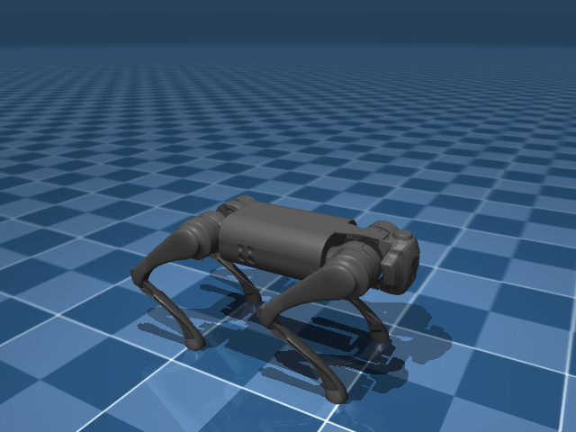
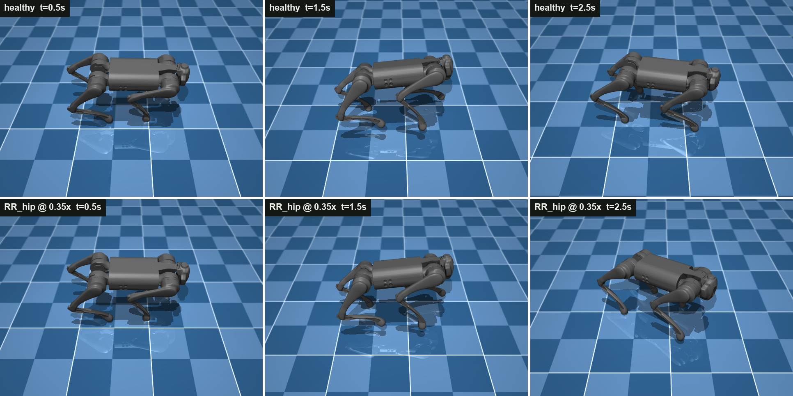
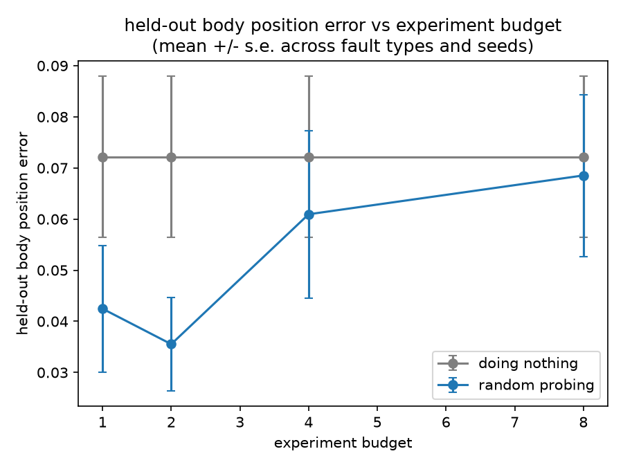
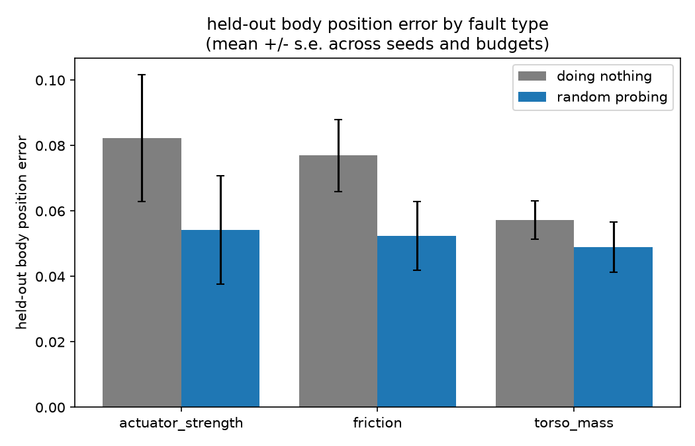
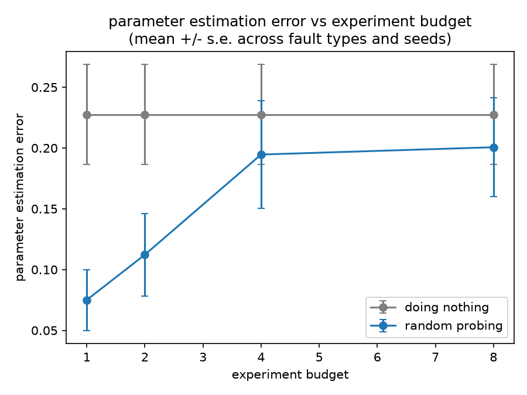

# what broke my robot?



Can an AI agent figure out what physically changed on a robot, just by running its own experiments on it, better than doing nothing and better than testing at random? That's the question this project answers.

I take a simulated Unitree Go1 quadruped in MuJoCo, secretly change one physical thing about it (friction, torso mass, or one leg motor's strength), and see if an agent can poke at it, read the data, and figure out what changed. Then I check if its guess actually predicts the robot better than doing nothing, and better than just probing around randomly.

## why I reused so much stuff

The interesting part is the agent doing diagnosis, not a simulator or an optimizer. So I grabbed what already exists:

- **robot**: Go1 from MuJoCo Menagerie, a submodule in `third_party/`.
- **controller**: the model's own standing pose, plus a hand-coded sine-wave trot on top. No training.
- **fitting**: `scipy.optimize.least_squares`.
- **agent**: Gemini API, plain function calling, no framework.

Everything else (env, perturbations, experiment API, agent loop) is mine.

## how it works

One round, an episode, works like this. I keep the fault itself simple: exactly one physical property changes per episode, and the agent gets a fixed budget of 8 experiments to figure out which one.

1. **Healthy robot.** Walking normally. All the agent is told about.
2. **Something breaks.** I secretly change grip, weight, or one leg motor's strength.
3. **It investigates.** It writes and runs its own test movements, up to 8 times.
4. **It answers.** It submits an estimate, for example that the left leg is at 80% strength.
5. **I grade it.** I test the estimate against new movements it never saw during testing.



Same walking command and starting position, shown at three points in time. Top row is healthy. Bottom row has one rear hip motor cut to 35% strength (exaggerated here for visibility). By 2.5 seconds it has tipped over.

### what the agent actually has access to

It never sees an image, a video, or a 3D scene, only four functions and whatever numbers they return:

- `inspect_model()`: static facts about the healthy robot (joint names, movement limits, standing pose). Free to call.
- `run_experiment(code, duration)`: the agent writes control code and runs it on the real, possibly broken robot. Costs 1 of its 8 tries.
- `inspect_trajectory(id)`: a numeric summary of a past run (body position over time, per-joint tracking error and force, which feet touched ground). Free, the agent can call it as many times as it wants.
- `submit_model(estimate)`: its final answer. Ends the episode.

Here's what `inspect_trajectory` actually returns after one real run against a robot with a weakened rear hip motor, no labels, no hint anything is wrong, just numbers:

```json
{
  "n_steps": 150,
  "torso_displacement_xyz": [0.061, 0.030, 0.007],
  "torso_min_height": 0.252,
  "torso_max_height": 0.306,
  "per_actuator": {
    "RR_hip":   { "mean_tracking_error": -0.004, "max_abs_tracking_error": 0.073 },
    "FR_thigh": { "mean_tracking_error":  0.041, "max_abs_tracking_error": 0.244 }
  },
  "foot_contact_fraction": { "FR": 0.65, "FL": 0.60, "RR": 0.60, "RL": 0.76 }
}
```

Figuring out that a specific rear hip motor is 18% weak from tables like this, in 8 tries or fewer, is the whole task.

## how it's laid out

```
third_party/mujoco_menagerie/   the Go1 model, pulled in as a submodule
src/
  env.py               thin wrapper around the mujoco model, step/reset/etc
  controller.py        standing pose + open loop trot gait
  perturbations.py     the hidden fault, applied to a cloned model
  prediction.py        turns an agent's guess into an actual model
  metrics.py           held out prediction error, nominal vs guess vs real
  experiment_api.py    the tool interface an agent uses to run experiments
agents/
  prompts.py           the system prompt for the coding agent
  coding_agent.py       the Gemini function-calling loop
baselines/
  nominal.py           baseline A, do nothing, just use the nominal model
  random_sysid.py      baseline B, random probing + scipy fit
scripts/
  sanity_check.py            checks the robot stands and walks without falling
  run_episode.py             runs baseline A and B against one hidden robot
  run_agent_episode.py       same thing, plus the Gemini agent
  run_benchmark.py           sweeps fault types x seeds x budgets, writes a CSV
  run_optimizer_comparison.py   fast fit vs slow-but-correct fit, same data
  render_snapshots.py        renders the pictures used in this README
  make_plots.py              turns a benchmark CSV into charts
report/                the write-up, with its own images
```

## setting it up

```
git submodule update --init --recursive
pip install -r requirements.txt
```

Check the robot actually works:

```
python scripts/sanity_check.py
```

You should see the standing controller hold at about 0.27m and the trot controller move forward without falling over. If it says "FELL", something's broken, probably the gait parameters are too aggressive again.

Run one full episode (secretly break something, run the random probing baseline, check if it beats doing nothing):

```
python scripts/run_episode.py
```

This takes a few minutes. It runs 8 experiments and fits 14 parameters with scipy, and each fit needs a bunch of full simulation rollouts, so just let it run.

To also run the coding agent, you need a Gemini API key. Export it, or drop a `.env` file in the repo root (it's gitignored, so it never gets committed):

```
GEMINI_API_KEY=your-key-here
```

Then:

```
python scripts/run_agent_episode.py
```

This makes real calls to the Gemini API, one per turn the agent takes, plus up to 8 more for the random baseline's fit. It prints the agent's tool calls as it goes so you can watch it think. If you want a different model, set `GEMINI_MODEL` (defaults to `gemini-3.5-flash`). A few notes from running this on a free-tier key: the pro-tier models need a paid plan, and `agents/coding_agent.py` retries both server overload errors and the free tier's per-minute rate limit on its own, so a slow run is normal, not stuck.

## a heads up on the friction perturbation

The foot geoms in the Go1 model have `priority=1` set. MuJoCo's contact solver picks whichever geom in a contact pair has the higher priority and uses only that geom's friction, no blending. So changing the floor's friction does nothing, since the foot always wins. I change friction on the feet instead, already handled that way in `perturbations.py`. Flagging it here in case future me, or an agent, tries to "fix" the floor friction value and wonders why nothing changes.

## results

I ran a full sweep: 3 fault types, 5 random severities, 4 test budgets (1, 2, 4, 8 experiments), 60 configurations total, no API calls needed. Random probing beats doing nothing on average for every fault type, though the margin is modest and doesn't improve steadily as the test budget grows.




### a real bug I found running the sweep

The first full run showed parameter error getting worse as the test budget increased from 1 to 8 experiments, backwards from what more data should do. The cause wasn't random probing itself: the curve-fitter's starting guess for leg-motor strength sat exactly on the edge of its allowed range, a known weak point for this type of optimizer, and it was quietly stopping after a handful of tries without raising an error.

I fixed the default the simple way: moving the starting guess slightly off the edge, which is almost free and resolves most of it. I also tried a more thorough fix, restarting the fit from several different points instead of one, which gets much closer (one config went from parameter error 0.24 to 0.0015) but costs 30 to 90 minutes per fit since it means re-running the simulation many more times. That's `fit_parameters_global` in `baselines/random_sysid.py`, kept as a separate, slower check rather than the default.



### the coding agent, 5 real episodes

I ran this against 5 different hidden faults with `gemini-3.5-flash`. The agent's own submitted answers explain the whole pattern:

| fault (true strength) | agent's guess | also guessed | outcome |
|---|---|---|---|
| RR_hip actuator, 0.818 | 0.80 | nothing extra | win, beat both baselines |
| FR_calf actuator, 0.788 | 0.80 | nothing extra | win, 0.0052 vs 0.131 / 0.102 |
| FR_thigh actuator, 0.944 (barely broken) | 0.94 | nothing extra | tie, 0.065 vs 0.056 / 0.054 |
| RR_thigh actuator, 0.887 | roughly right | friction 1.5x, mass 1.3x (both wrong) | loss, 0.250 vs 0.071 / 0.071 |
| FR_calf actuator, 0.712 | 0.71 | friction 0.64x, mass 2.25x (both wrong) | loss, 0.236 vs 0.157 / 0.157 |

Every time the agent left friction and mass alone, since it hadn't actually tested them, it won outright or tied a case where doing nothing was already close to optimal. Every time it also guessed at friction or mass, that guess was wrong, and was enough on its own to lose to doing nothing, even though its leg-motor estimate in those same two runs was the most accurate in the whole study (parameter error 0.0018 and 0.0044, better than either baseline).

The agent's diagnosis of the actual fault was consistently good across all five runs. The failure was submitting confident values for parameters it had no evidence about. One fix worth trying: telling the agent in the prompt that a wrong guess costs more than an honest blank.

Five episodes isn't a full benchmark. Running the same sweep with the agent included, at real scale, is what would tell you if this holds up, that costs real API time and budget, which is why it isn't done yet.

## running the actual benchmark

`run_agent_episode.py` is one episode. The real question, does the agent beat random probing, and does that hold up across fault types, seeds, and budgets, needs the full sweep:

```
python scripts/run_benchmark.py
```

By default this only runs the two free, local baselines (`nominal` and `random_sysid`) across 3 fault types x 5 seeds x budgets [1, 2, 4, 8], 60 configs, no API calls, a few minutes to maybe an hour depending on budget size.

To also include the real Gemini coding agent, pass `--include-agent`. Each config is a full multi-turn API episode, so this is slow and burns free-tier rate limit fast. Worth narrowing the sweep a lot when you do:

```
python scripts/run_benchmark.py --include-agent --fault-types actuator_strength --n-seeds 3 --budgets 8
```

`--resume` skips any combo already in the output CSV, so a long sweep can be killed and picked back up. Agent transcripts get saved under `results/traces/` for a qualitative look, not just numbers.

To compare `fit_parameters` (fast, the default) against `fit_parameters_global` (slow, more accurate on actuator faults) on identical random-probe data:

```
python scripts/run_optimizer_comparison.py
```

This is genuinely slow, budget-8 configs cost 30 to 90 minutes apiece, and writes to `results/optimizer_comparison.csv` incrementally, so it's safe to interrupt and rerun.

Once you have a CSV:

```
python scripts/make_plots.py
```

Writes three charts to `results/`: held-out error vs budget, parameter estimation error vs budget, and error broken down by fault type.

## what's not built yet

`tests/` is still empty. Everything else in `context/build_plan.md`'s roadmap is wired up and has been run for real. The full agent sweep at scale (many seeds per fault type, real API cost) is the one thing that would turn "5 episodes show a pattern" into a real answer to "does the agent beat random probing."
